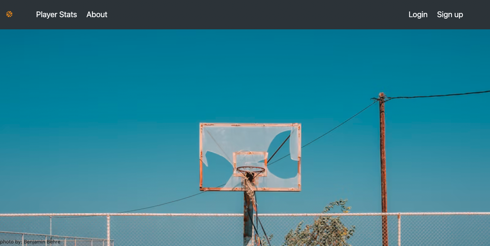
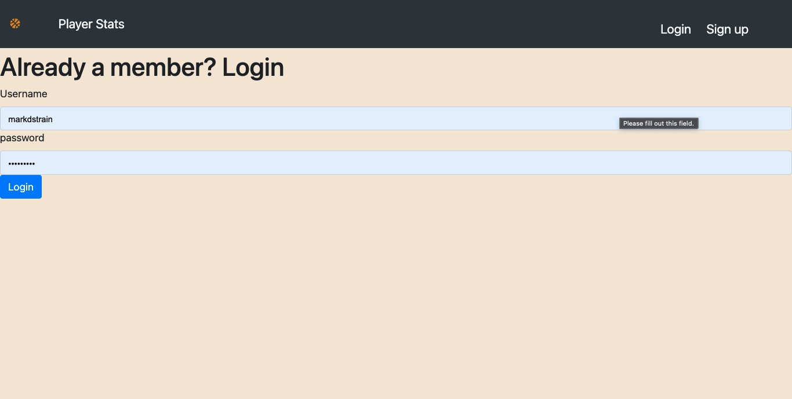
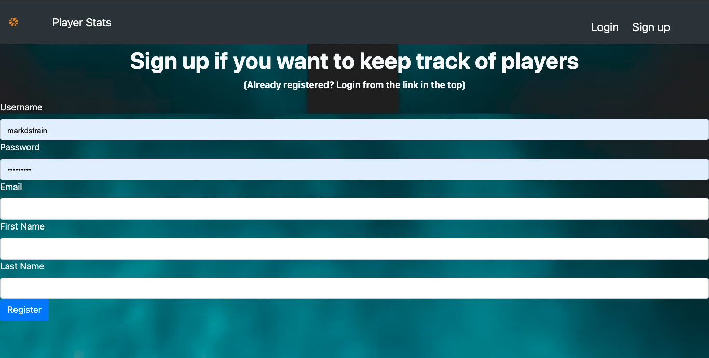
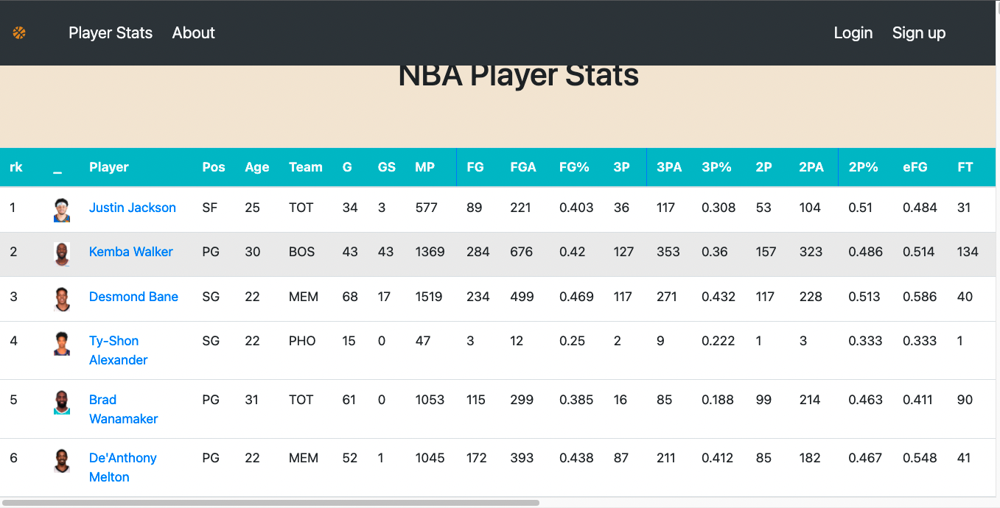
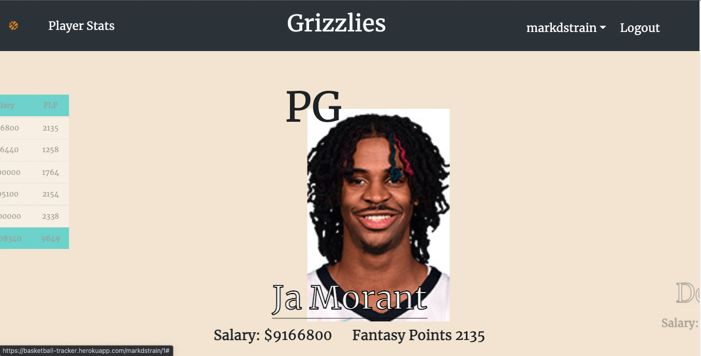

# NBAstats
This is a project in learning how to scrape data and produce up to date Fantasy League Basketball points
I've used beautiful soup to scrape data from basketball-referenc.com to get my data and I have used python scheduler to keep it up to date.
For right now user's can track their favorite players and keep up with their fantasy league points but eventually I hope to make it so that
users can enter into a fantasy league competition 

Demo: https://basketball-tracker.herokuapp.com/

# Images

# Requirements

async-generator==1.10.  
attrs==20.3.0.   
bcrypt==3.2.0.   
beautifulsoup4==4.9.3.        
Flask==1.1.2.  
Flask-Bcrypt==0.7.1.  
Flask-DebugToolbar==0.11.0.   
Flask-SQLAlchemy==2.4.4     
Flask-WTF==0.14.3.   
idna==2.10.   
importlib-metadata==3.4.0.   
ipykernel==5.4.3.   
ipython==7.19.0.   
ipython-genutils==0.2.0.   
ipywidgets==7.6.3.   
itsdangerous==1.1.0.   
jedi==0.18.0.   
Jinja2==2.11.2.   
jsonschema==3.2.0.   
lxml==4.6.2.   
MarkupSafe==1.1.1.   
mistune==0.8.4.   
nbclient==0.5.1    
nbconvert==6.0.7.   
nbformat==5.1.2.   
numpy==1.19.5.   
packaging==20.8.   
pandas==1.2.0.   
prometheus-client==0.9.0.   
soupsieve==2.1.   
prometheus-client==0.9.0.   
SQLAlchemy==1.3.22.   
testpath==0.4.4  
WTForms==2.3.3.   
testpath==0.4.4  
